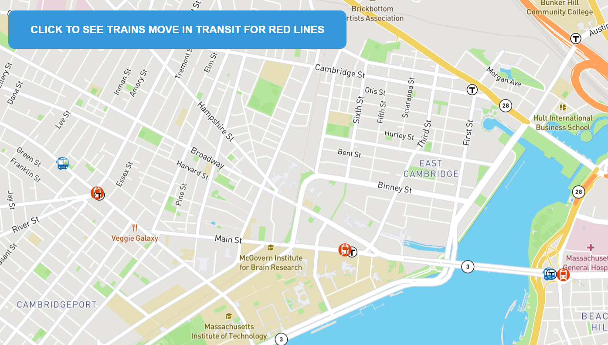

# Boston Transit Bus Tracker

## Table of content

- [Description](#description)
- [How to Run the Application](#howtorun)
- [Roadmap of Future Improvements](#roadmap)
- [License](#license)
- [Demo](#demo)

## Description
This web app displays the transit stations for the Boston Green and Red Lines as well as current vehicles in route.  Clicking on the button above will move the vehicles using real time data from the MBTA server via a JSON call.  Due to the amount of data, the application only pulls data for all vehicles that are currently active on the Red transit Line.

## Setting Up and Running The Application

### About

There is only 3 main files for this project including styles.css, index.html and mapanimation.js.   There are also 3 images used that can be found in the images folder.   You can download these files and run index.html from your local machine or the project can be ran from github at https://pamelaarcher.github.io/bostontransit

This application is made up of 3 main files and an images directory
  - <b>styles.css</b> which includes the classes for the button, map as well as station and bus markers.
  - <b>index.html</b> which provides the links to bring in the <b>Mapbox</b> server map of Boston and calls the move() on button click to bring in new transit data
  - <b>mapanimation.js</b> which displays the Mapbox map and then calls the MBTA server to bring in route, station and vehicle data for the Green and Red lines and display markers on the map. The move() function will make a new call to the server for the latest vehicle position information and change the location of the vehicle markers on button click.
  - <b>images directory</b> includes images for the red and green station markers as well as the buses in transit

### Running the Application
 (1) You can download these 3 files and images directory to a directory on your local drive.  Once installed in a directory, run the index.html file from a new web page OR you can run the application direct from github from the link, https://pamelaarcher.github.io/bostontransit/   
 (2) Click on the top button and see the vehicles move
 
## Roadmap of Future Improvements
•	Pulldowns that include list of different transit lines that can choose from.  The stations and vehicles will show for these stations.
•	Additional work on the button that currently brings in the latest longitude and latitude.  You can also see if vehicles have been added or have gone out of service.
•	Popups that provide details about the stops including addresses and services available at the stations
•	Popups about the vehicles including the id, whether outbound or inbound and other available information
•	Create better markers for stations and vehicles

## License

MIT License

Copyright (c) 2022
Permission is hereby granted, free of charge, to any person obtaining a copy of this software and associated documentation files (the "Software"), to deal in the Software without restriction, including without limitation the rights to use, copy, modify, merge, publish, distribute, sublicense, and/or sell copies of the Software, and to permit persons to whom the Software is furnished to do so, subject to the following conditions:

The above copyright notice and this permission notice shall be included in all copies or substantial portions of the Software.

THE SOFTWARE IS PROVIDED "AS IS", WITHOUT WARRANTY OF ANY KIND, EXPRESS OR IMPLIED, INCLUDING BUT NOT LIMITED TO THE WARRANTIES OF MERCHANTABILITY, FITNESS FOR A PARTICULAR PURPOSE AND NONINFRINGEMENT. IN NO EVENT SHALL THE AUTHORS OR COPYRIGHT HOLDERS BE LIABLE FOR ANY CLAIM, DAMAGES OR OTHER LIABILITY, WHETHER IN AN ACTION OF CONTRACT, TORT OR OTHERWISE, ARISING FROM, OUT OF OR IN CONNECTION WITH THE SOFTWARE OR THE USE OR OTHER DEALINGS IN THE SOFTWARE.

## Demo

* [Boston Transit Demo](https://pamelaarcher.github.io/bostontransit)
